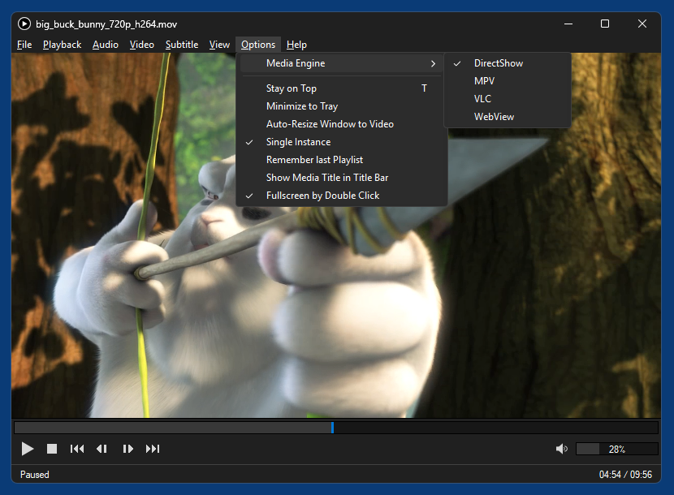

# SMP (SimpleMediaPlayer)

SMP is a simple desktop media player for Windows 11 x64 written in Python. What makes it special is that it supports 4 different multimedia engines (or frameworks) that a user can choose from. Note that changing the active engine requires the current player instance to be restartet.

The application comes initially only with the WebView engine (and the VLC engine, if a VLC media player was found on the PC), other engines are downloaded when first selected.

## MultiMedia Engines

### 1. DirectShow

DirectShow playback is based on [LAV Filters](https://github.com/Nevcairiel/LAVFilters) (which are in turn based on [FFmpeg](https://ffmpeg.org/)) and [MPC Video Renderer](https://github.com/Aleksoid1978/VideoRenderer). Subtitles support is based on [VSFilter](https://github.com/v0lt/VSFilterBE) (DirectVobSub). MIDI files are played with [Bass Audio Source](https://github.com/v0lt/BassAudioSource) and [BASSMIDI](https://www.un4seen.com/doc/#bassmidi/bassmidi.html), which allows to use a SoundFont as soundbank (see [MIDI Support](#midi-support) below).

Filters are loaded directly from .dll and therefor don't need to be registered in the system.

### 2. mpv

[mpv](https://mpv.io/) playback is based on [libmpv](https://sourceforge.net/projects/mpv-player-windows/files/libmpv/) and its Python binding [python-mpv](https://github.com/jaseg/python-mpv).

Since mpv can't play MIDI files, an additional minimal DirectShow player that doesn't depend on the DirectShow engine is used to play those.

### 3. VLC

VLC playback is based on [libVLC](https://images.videolan.org/vlc/libvlc.html) and its Python binding [python-vlc](https://github.com/oaubert/python-vlc).

### 4. WebView

WebView playback uses [Microsoft Edge WebView2](https://developer.microsoft.com/en-us/microsoft-edge/webview2), which is based on recent Chrome/Chromium versions and comes preinstalled with Windows 11. MIDI support is based on [spessasynth_lib](https://github.com/spessasus/spessasynth_lib).

WebView supports less features, container formats and codecs than the other engines, but has the benefit of minimum extra file size, since WebView2 is already provided by the OS.

## MIDI Support

All engines support playing MIDI files (`.mid` `.rmi` `.kar`). All but mpv use an external [SoundFont](https://en.wikipedia.org/wiki/SoundFont) file as soundbank. To keep the player's download file size small, only a [small SoundFont](https://musical-artifacts.com/artifacts/5190) (3 MB, based on GM.dls that comes with Windows) is included as file `soundbank.sf2` in the `data` folder. For achieving better MIDI sound quality you can replace this file with a high-quality SoundFont file like e.g. [FluidR3_GM.sf2](https://musical-artifacts.com/artifacts/738) (141 MB) or [Reality_GMGS_falcomod.sf2](https://www.musical-artifacts.com/artifacts/6003) (34 MB). After downloading such a file, just rename it `soundbank.sf2` and put it into `data`.

If you happen to be a MIDI nerd, the WebView engine is the only one that supports the rather exotic but interesting [SF2 RMIDI](https://github.com/spessasus/sf2-rmidi-specification) file format that allows to combine MIDI and soundbank data in a single `.rmi` file.
